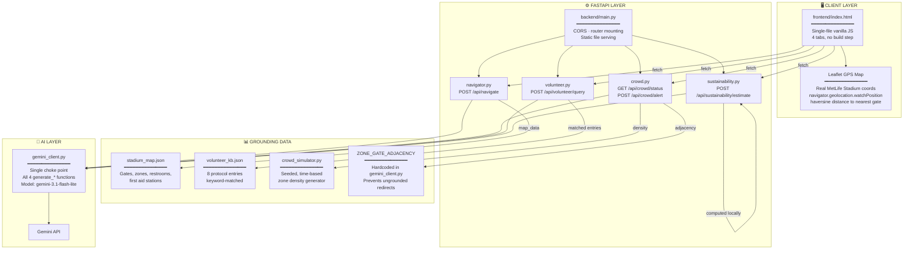
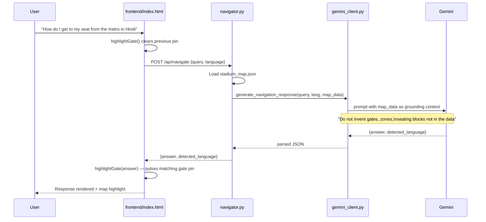
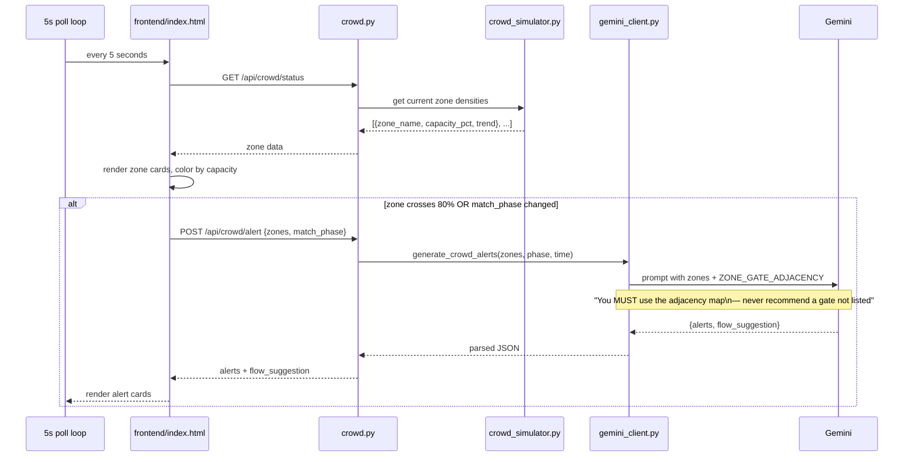
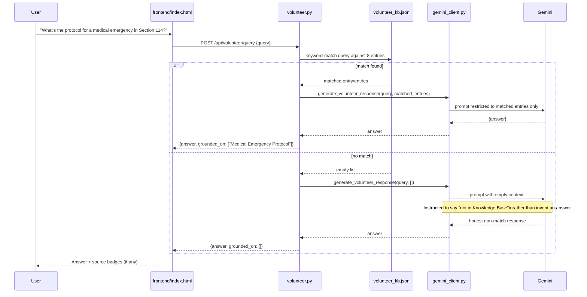
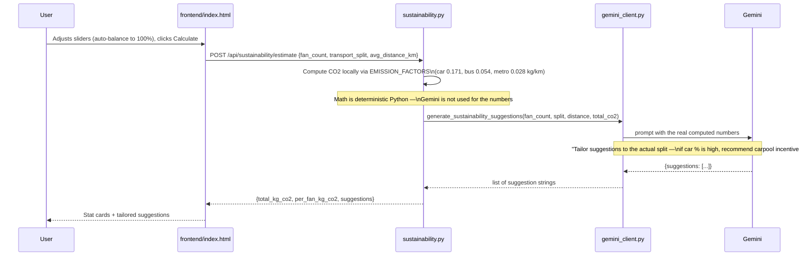
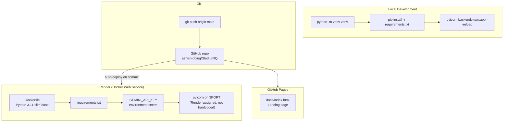

# StadiumIQ — Architecture

## Overview

StadiumIQ is a four-router FastAPI backend behind a single Gemini choke point. Every feature — Navigator, Crowd Intelligence, Volunteer Assistant, Sustainability — follows the same discipline: pull real structured data, inject it into the prompt as grounding context, and instruct Gemini not to answer beyond what's provided. A single-file vanilla JS frontend consumes all four endpoints and adds a live Leaflet GPS map layered on top of the real host-venue coordinates.

---

## System Diagram

---

## Request Flow — Fan Navigator

---

## Request Flow — Crowd Intelligence (Adjacency-Grounded)

This is the flow the grounding fix targets directly: before the adjacency map was added to the prompt, Gemini could recommend redirecting Zone B traffic to Gate D — a real gate, but not actually adjacent to Zone B. `ZONE_GATE_ADJACENCY` closes that gap by making the correct mapping part of the prompt context, not something the model has to infer.

---

## Request Flow — Volunteer Assistant

---

## Request Flow — Sustainability Tracker

Note the split of responsibility: the carbon math is deterministic Python, never delegated to Gemini. Gemini's job is strictly the qualitative recommendations layered on top of real numbers — a smaller, more auditable surface for the model to get wrong.

---

## Component Reference

| Component | File | Responsibility |
|---|---|---|
| **Entrypoint** | `backend/main.py` | FastAPI app, CORS, router mounting, serves `frontend/index.html` |
| **Gemini Client** | `backend/gemini_client.py` | Single choke point — all 4 `generate_*` functions, model config, `ZONE_GATE_ADJACENCY` |
| **Schemas** | `backend/models.py` | Pydantic request/response models for all 4 endpoints |
| **Navigator Router** | `backend/routers/navigator.py` | Loads `stadium_map.json`, calls `generate_navigation_response` |
| **Crowd Router** | `backend/routers/crowd.py` | Reads `crowd_simulator.py`, calls `generate_crowd_alerts` |
| **Volunteer Router** | `backend/routers/volunteer.py` | Keyword-matches `volunteer_kb.json`, calls `generate_volunteer_response` |
| **Sustainability Router** | `backend/routers/sustainability.py` | Computes CO₂ locally, calls `generate_sustainability_suggestions` |
| **Stadium Map** | `backend/data/stadium_map.json` | Gates, zones, restrooms, first-aid stations — Navigator grounding source |
| **Volunteer KB** | `backend/data/volunteer_kb.json` | 8 protocol entries — Volunteer grounding source |
| **Crowd Simulator** | `backend/data/crowd_simulator.py` | Seeded, time-based density generator — not live sensor data |
| **Frontend** | `frontend/index.html` | Single-file dashboard, 4 tabs, Leaflet GPS map, auto-balancing sliders |
| **Tests** | `tests/test_stadiumiq.py` | 17 unit tests — requires a `GEMINI_API_KEY` env var (dummy value works) |
| **Model Checker** | `scripts/check_model.py` | Dev utility — tests live model availability against your API key |
| **Landing Page** | `docs/index.html` | GitHub Pages marketing site |

---

## Grounding Discipline

Every one of the four `generate_*` functions in `gemini_client.py` follows the same pattern:

1. Real structured data (map, KB, density, adjacency, or computed numbers) is serialized and injected directly into the prompt
2. The prompt explicitly instructs Gemini not to invent anything outside that context
3. On any error (API failure, malformed JSON), the function fails to a static, honest fallback string rather than a silent guess

This is the difference between "grounded" as a marketing word and grounded as an enforced code pattern — the constraint lives in the prompt template every single call goes through, not in a policy nobody checks.

---

## Key Version Constraints

| Package | Version | Reason |
|---|---|---|
| `google-generativeai` | pinned | Legacy SDK — Google's support has ended in favor of `google-genai`; migration tracked as a non-blocking follow-up (see `CONTEXT.md`) |
| `gemini-3.1-flash-lite` | — | Chosen after `gemini-2.5-flash-lite` began returning premature 404s for new API keys mid-build; confirmed via `scripts/check_model.py` |
| `fastapi` | `0.115.x` | Stable, async, auto-generated `/docs` |
| `python` | `3.11` | Docker base image target |
| Leaflet | `1.9.4` (CDN) | No API key required, unlike Google Maps JS |

---

## Deployment Architecture

---

*Built for PromptWars Virtual — Challenge 4: Smart Stadiums & Tournament Operations*