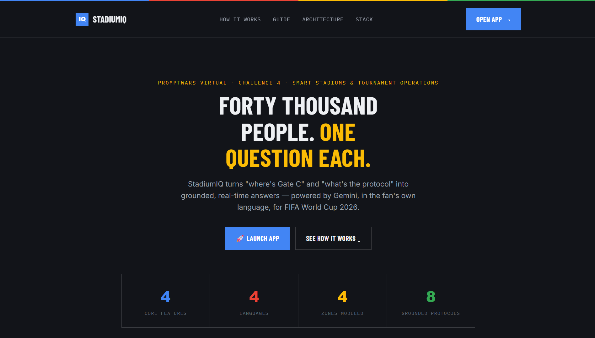
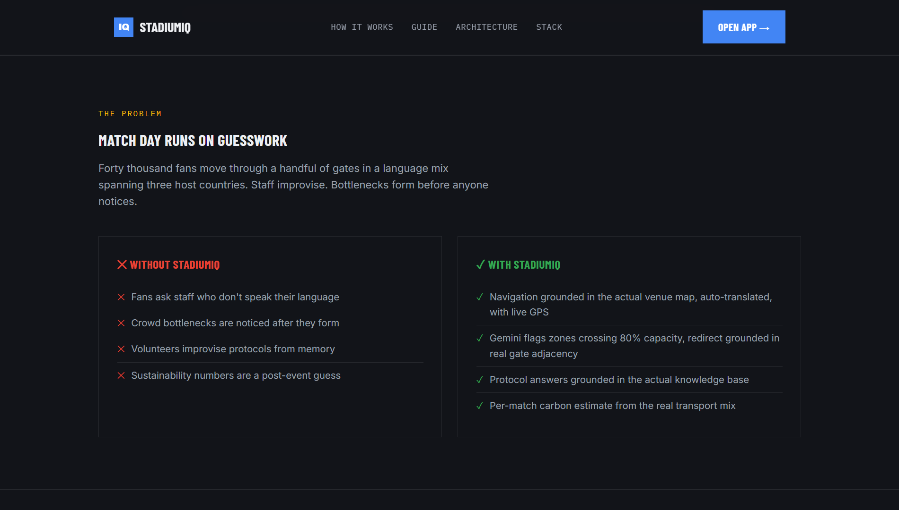
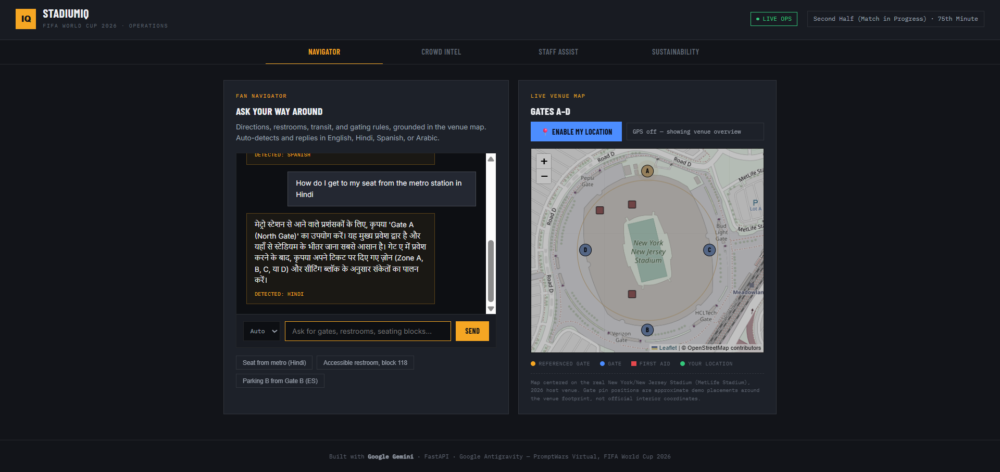
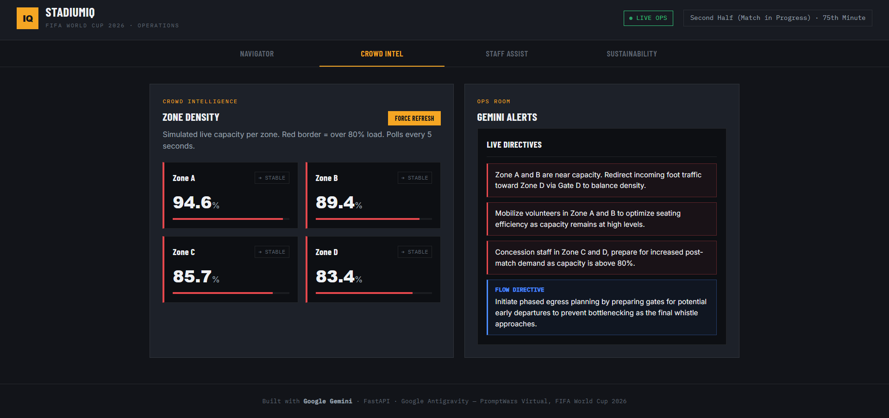
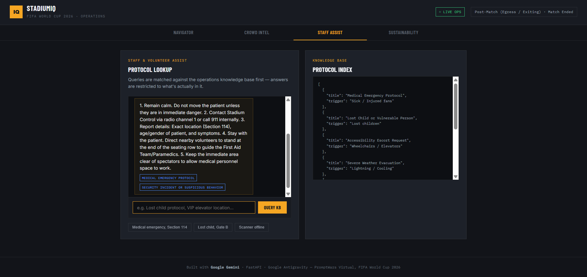
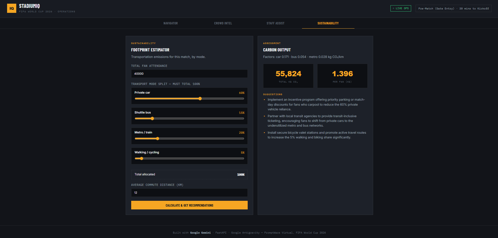
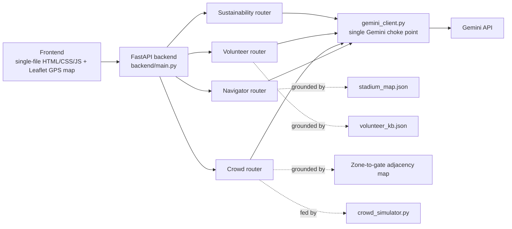

<div align="center">

<br>
<br>
<br>


</div>

<p align="center">
  
  
  
  
  
  
</p>

<p align="center">
  <strong>PromptWars Virtual — Challenge 4: Smart Stadiums & Tournament Operations</strong>
</p>

<p align="center">
<a href="https://stadiumiq-2ip5.onrender.com"><b>Live App</b></a> · <a href="https://ashish-doing.github.io/StadiumIQ">Landing</a> · <a href="https://stadiumiq-2ip5.onrender.com/docs">API Docs</a> · <a href="./ARCHITECTURE.md">Architecture</a> · <a href="./CONTEXT.md">Build Log</a> · <a href="#quick-start">Quick Start</a>
</p>

---

> *Fans lost, staff improvising, and forty thousand people moving through a handful of gates at once — StadiumIQ is the layer that turns "where do I go" and "what do I do" into grounded, real-time answers, in the fan's own language.*

## What It Does

FIFA World Cup 2026 spans three host countries and a genuinely multilingual fanbase. StadiumIQ is a GenAI operations layer that helps four different groups on match day:

- **Fans** — ask for directions, restrooms, or transit in plain language, in Hindi, Spanish, Arabic, or English, with a **live GPS map** showing real gate positions around the actual host venue
- **Operations staff** — watch simulated zone-by-zone crowd density and get AI-generated redirect alerts, grounded in a real zone-to-gate adjacency map so recommendations can't invent a gate that isn't actually nearby
- **Volunteers** — query emergency and operational protocols and get answers grounded in an actual knowledge base, not improvised
- **Sustainability planners** — estimate per-match carbon footprint from the transport mix and get suggestions targeted at the actual split, not generic advice

Every AI response is grounded in real structured data passed into the Gemini prompt — the model is explicitly instructed not to invent gates, protocols, or numbers that aren't in the provided context. Full data-flow diagrams for all four features are in **[ARCHITECTURE.md](./ARCHITECTURE.md)**.

---

## Live Demo

[](https://stadiumiq-2ip5.onrender.com)
[](https://ashish-doing.github.io/StadiumIQ)

> **Note:** the live app runs on Render's free tier, which spins down after periods of inactivity. If it's been idle, the first request may take 30–60 seconds to wake up — this is expected, not a bug. Subsequent requests are fast.

---

## Features

| Feature | What It Does | Endpoint |
|---|---|---|
| 🗺️ **Fan Navigator** | Natural-language, auto-language-detected stadium navigation, grounded in venue map data, with a live interactive GPS map (Leaflet, real MetLife Stadium / "New York/New Jersey Stadium" coordinates) | `POST /api/navigate` |
| 📊 **Crowd Intelligence Dashboard** | Simulated live zone density + AI-generated operational alerts, redirect suggestions grounded in a real zone-to-gate adjacency map | `GET /api/crowd/status`, `POST /api/crowd/alert` |
| 🤝 **Volunteer / Staff Assistant** | Protocol Q&A grounded in a stadium operations knowledge base, honest when nothing matches | `POST /api/volunteer/query` |
| 🌱 **Sustainability Tracker** | Per-match CO₂ estimate from transport mix + AI suggestions tailored to the actual split, auto-balancing sliders that always sum to 100% | `POST /api/sustainability/estimate` |

---

## Screenshots

**The Landing Page**

| | |
|---|---|
|  |  |
| *Hero section — stat row in the Google four-color system* | *Problem framing — match day with and without StadiumIQ* |

**The App**

| | |
|---|---|
|  |  |
| *Fan Navigator — multilingual, grounded in stadium map data, live GPS venue map* | *Crowd Intelligence — zone density + Gemini operations alerts grounded in gate adjacency* |
|  |  |
| *Volunteer Assistant — grounded protocol answers with source shown* | *Sustainability Tracker — transport-mix-aware CO₂ estimate with tailored suggestions* |

---

## Architecture



Every feature router calls through a single `gemini_client.py` — one choke point for all Gemini calls, one place to swap models, one place the grounding-instruction pattern lives.

**[See ARCHITECTURE.md](./ARCHITECTURE.md)** for the full system diagram plus a per-feature sequence diagram for all four endpoints, including the adjacency-grounding fix in detail.

---

## Tech Stack

| Layer | Technology | Purpose |
|---|---|---|
| Backend | FastAPI, Python 3.11, Uvicorn | API + static file serving |
| AI | Gemini (`gemini-3.1-flash-lite`) via `google-generativeai` SDK | Navigation, alerts, protocol Q&A, sustainability suggestions |
| Frontend | Vanilla HTML/CSS/JS, single file | No framework, no build step |
| Maps | Leaflet.js + OpenStreetMap | Free, no API key, live GPS-based venue navigation |
| Config | python-dotenv | `GEMINI_API_KEY` from environment, never hardcoded |
| Deployment | Docker on Render (free tier) | Live public preview |
| Testing | pytest | 7 offline unit tests — sustainability math, KB honesty, adjacency grounding |
| Dev tool | Google Antigravity | Agentic IDE used to build the full codebase — see [CONTEXT.md](./CONTEXT.md) |

**Note on model choice:** the Gemini 2.5 family (`gemini-2.5-flash`, `gemini-2.5-flash-lite`) began returning premature 404s on newer API keys during this build, ahead of their official October 2026 deprecation date. `scripts/check_model.py` tests live availability against your own key and confirmed `gemini-3.1-flash-lite` as the stable working choice — see the script if you need to re-verify after a Google-side model change.

---

## Built with Google Antigravity

This project was built end-to-end inside **Google Antigravity**, as required for PromptWars Virtual submissions. **[CONTEXT.md](./CONTEXT.md)** documents the real build session in detail — the mission brief, actual prompts used, and the real problems hit along the way (a dead model reference, an API project access issue, a Hugging Face Spaces policy change requiring a platform pivot, and a Render port-binding fix) — not a cleaned-up retelling.

---

## Quick Start

### 1. Clone

```bash
git clone https://github.com/ashish-doing/StadiumIQ.git
cd StadiumIQ
```

### 2. Set up environment

```bash
python -m venv venv
venv\Scripts\activate          # Windows
# source venv/bin/activate     # macOS/Linux

pip install -r requirements.txt
```

### 3. Configure your API key

```bash
cp .env.example .env
```

Edit `.env`:
```env
GEMINI_API_KEY=your_actual_key_here
```

Get a key at [aistudio.google.com](https://aistudio.google.com) — the app will fail to start with a clear error if this is missing. If Gemini models seem unavailable, run `python scripts/check_model.py` to see which models actually work with your key.

### 4. Run

```bash
uvicorn backend.main:app --reload
```

Open **http://127.0.0.1:8000**

### 5. Run tests

```bash
pip install pytest
pytest backend/tests/ -v
```

7 tests, all offline — no API key or network required.

---

## API Reference

Full interactive Swagger docs are auto-generated by FastAPI and live at **[/docs](https://stadiumiq-2ip5.onrender.com/docs)** on both local and deployed instances.

| Method | Endpoint | Purpose |
|---|---|---|
| `POST` | `/api/navigate` | Multilingual fan navigation, grounded in stadium map |
| `GET` | `/api/crowd/status` | Current simulated zone density |
| `POST` | `/api/crowd/alert` | AI-generated operational alerts, grounded in zone-gate adjacency |
| `POST` | `/api/volunteer/query` | Protocol Q&A grounded in volunteer knowledge base |
| `POST` | `/api/sustainability/estimate` | Carbon footprint estimate + tailored suggestions |
| `GET` | `/docs` | Interactive Swagger UI |
| `GET` | `/` | Frontend dashboard |

---

## Demo Queries to Validate

**1. Fan Navigator (multilingual + grounded)**
```json
POST /api/navigate
{"query": "How do I get to my seat from the metro station in Hindi"}
```
Detects Hindi, responds in Hindi, cites actual gates/zones from `stadium_map.json`.

**2. Volunteer Assistant (grounded, not improvised)**
```json
POST /api/volunteer/query
{"query": "What's the protocol for a medical emergency in Section 114?"}
```
Returns an answer grounded on the Medical Emergency protocol entry, with `grounded_on` naming the source.

**3. Sustainability Tracker (transport-mix-aware)**
```json
POST /api/sustainability/estimate
{
  "fan_count": 40000,
  "transport_split": {"car": 60, "bus": 15, "metro": 20, "walk": 5},
  "avg_distance_km": 12
}
```
Returns total and per-fan CO₂ (55,824 kg total, 1.396 kg/fan), with suggestions specifically addressing the 60% car share.

---

## Deployment

Live on **Render** (Docker Web Service, free tier):

- Build: auto-detected `Dockerfile`
- `GEMINI_API_KEY` set as a Render environment variable, never committed
- Listens on Render's dynamic `$PORT`

To redeploy your own copy: connect the repo on [render.com](https://render.com) as a new Web Service, select Docker, add `GEMINI_API_KEY` under Environment, deploy.

---

## Project Structure

```
stadiumiq/
├── backend/
│   ├── main.py                  FastAPI entrypoint, CORS, routing
│   ├── gemini_client.py         Single choke point for all Gemini calls
│   ├── models.py                Pydantic request/response schemas
│   ├── routers/
│   │   ├── navigator.py         /api/navigate
│   │   ├── crowd.py             /api/crowd/status, /api/crowd/alert
│   │   ├── volunteer.py         /api/volunteer/query
│   │   └── sustainability.py    /api/sustainability/estimate
│   ├── data/
│   │   ├── stadium_map.json     Grounding source for navigation
│   │   ├── volunteer_kb.json    Grounding source for protocol Q&A
│   │   └── crowd_simulator.py   Seeded live-look density generator
│   └── tests/
│       └── test_stadiumiq.py    7 offline unit tests
├── frontend/
│   └── index.html               Single-file dashboard, live GPS map
├── scripts/
│   └── check_model.py           Dev utility: tests which Gemini models work with your key
├── docs/
│   ├── index.html               GitHub Pages landing page
│   └── screenshots/
├── requirements.txt
├── Dockerfile
├── .env.example
├── CONTEXT.md                   Real Antigravity build log
├── ARCHITECTURE.md              Full system diagram + per-feature sequence flows
├── LICENSE
└── README.md
```

---

## Author

**Ashish Kumar** — B.Tech ECE, IIIT Guwahati (Batch 2024)

[](https://github.com/ashish-doing)
[](https://linkedin.com/in/ashish-kumar-014aaa3b9)

---

## License

MIT — see [LICENSE](LICENSE) for details.

---

<div align="center">

Built for **PromptWars Virtual — Challenge 4: Smart Stadiums & Tournament Operations**

*Powered by Google Gemini · Google Antigravity · FastAPI · Leaflet*

</div>