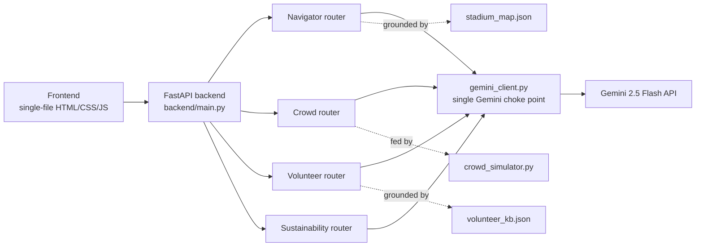

<div align="center">


</div>

<p align="center">
  
  
  
  
  
</p>

<p align="center">
  <strong>PromptWars Virtual — Challenge 4: Smart Stadiums & Tournament Operations</strong>
</p>

<p align="center">
  🚀 <a href="https://stadiumiq-2ip5.onrender.com">Live App</a> &nbsp;•&nbsp;
  📖 <a href="https://stadiumiq-2ip5.onrender.com/docs">API Docs (Swagger)</a> &nbsp;•&nbsp;
  💻 <a href="https://github.com/ashish-doing/StadiumIQ">GitHub</a> &nbsp;•&nbsp;
  ⚡ <a href="#quick-start">Quick Start</a>
</p>

---

> *Fans lost, staff improvising, and forty thousand people moving through a handful of gates at once — StadiumIQ is the layer that turns "where do I go" and "what do I do" into grounded, real-time answers, in the fan's own language.*

## What It Does

FIFA World Cup 2026 spans three host countries and a genuinely multilingual fanbase. StadiumIQ is a GenAI operations layer that helps four different groups on match day:

- **Fans** — ask for directions, restrooms, or transit in plain language, in Hindi, Spanish, Arabic, or English
- **Operations staff** — watch simulated zone-by-zone crowd density and get AI-generated redirect alerts before a bottleneck forms
- **Volunteers** — query emergency and operational protocols and get answers grounded in an actual knowledge base, not improvised
- **Sustainability planners** — estimate per-match carbon footprint from the transport mix and get suggestions targeted at the actual split, not generic advice

Every AI response is grounded in real structured data passed into the Gemini prompt — the model is explicitly instructed not to invent gates, protocols, or numbers that aren't in the provided context.

---

## Live Demo

[](https://stadiumiq-2ip5.onrender.com)

> **Note:** the live app runs on Render's free tier, which spins down after periods of inactivity. If it's been idle, the first request may take 30–60 seconds to wake up — this is expected, not a bug. Subsequent requests are fast.

---

## Features

| Feature | What It Does | Endpoint |
|---|---|---|
| 🗺️ **Fan Navigator** | Natural-language, auto-language-detected stadium navigation, grounded in venue map data | `POST /api/navigate` |
| 📊 **Crowd Intelligence Dashboard** | Simulated live zone density heatmap + AI-generated operational alerts and flow suggestions | `GET /api/crowd/status`, `POST /api/crowd/alert` |
| 🤝 **Volunteer / Staff Assistant** | Protocol Q&A grounded in a stadium operations knowledge base, honest when nothing matches | `POST /api/volunteer/query` |
| 🌱 **Sustainability Tracker** | Per-match CO₂ estimate from transport mix + AI suggestions tailored to the actual split | `POST /api/sustainability/estimate` |

---

## Screenshots

*(Add your screenshots here before submission — see `docs/screenshots/` convention used in your other projects)*

| | |
|---|---|
|  |  |
| *Fan Navigator — multilingual, grounded in stadium map data* | *Crowd Intelligence — live heatmap + Gemini operations alerts* |
|  |  |
| *Volunteer Assistant — grounded protocol answers with source shown* | *Sustainability Tracker — transport-mix-aware CO₂ estimate* |

---

## Architecture



Every feature router calls through a single `gemini_client.py` — one choke point for all Gemini calls, one place to swap models, one place the grounding-instruction pattern lives.

---

## Tech Stack

| Layer | Technology | Purpose |
|---|---|---|
| Backend | FastAPI, Python 3.11, Uvicorn | API + static file serving |
| AI | Gemini 2.5 Flash (`google-generativeai` SDK) | Navigation, alerts, protocol Q&A, sustainability suggestions |
| Frontend | Vanilla HTML/CSS/JS, single file | No framework, no build step |
| Config | python-dotenv | `GEMINI_API_KEY` from environment, never hardcoded |
| Deployment | Docker on Render (free tier) | Live public preview |
| Dev tool | Google Antigravity | Agentic IDE used to build the full codebase |

---

## Built with Google Antigravity

This project was built end-to-end inside **Google Antigravity**, as required for PromptWars Virtual submissions — the full backend, frontend, and Docker configuration were generated and iterated on through Antigravity's agent, then deployed and debugged interactively.

---

## Quick Start

### 1. Clone

```bash
git clone https://github.com/ashish-doing/StadiumIQ.git
cd StadiumIQ
```

### 2. Set up environment

```bash
python -m venv venv
venv\Scripts\activate          # Windows
# source venv/bin/activate     # macOS/Linux

pip install -r requirements.txt
```

### 3. Configure your API key

```bash
cp .env.example .env
```

Edit `.env`:
```env
GEMINI_API_KEY=your_actual_key_here
```

Get a key at [aistudio.google.com](https://aistudio.google.com) — the app will fail to start with a clear error if this is missing.

### 4. Run

```bash
uvicorn backend.main:app --reload
```

Open **http://127.0.0.1:8000**

---

## API Reference

Full interactive Swagger docs are auto-generated by FastAPI and live at **[/docs](https://stadiumiq-2ip5.onrender.com/docs)** on both local and deployed instances.

| Method | Endpoint | Purpose |
|---|---|---|
| `POST` | `/api/navigate` | Multilingual fan navigation, grounded in stadium map |
| `GET` | `/api/crowd/status` | Current simulated zone density |
| `POST` | `/api/crowd/alert` | AI-generated operational alerts from density data |
| `POST` | `/api/volunteer/query` | Protocol Q&A grounded in volunteer knowledge base |
| `POST` | `/api/sustainability/estimate` | Carbon footprint estimate + tailored suggestions |
| `GET` | `/docs` | Interactive Swagger UI |
| `GET` | `/` | Frontend dashboard |

---

## Demo Queries to Validate

**1. Fan Navigator (multilingual + grounded)**
```json
POST /api/navigate
{"query": "How do I get to my seat from the metro station in Hindi"}
```
Detects Hindi, responds in Hindi, cites actual gates/zones from `stadium_map.json`.

**2. Volunteer Assistant (grounded, not improvised)**
```json
POST /api/volunteer/query
{"query": "What's the protocol for a medical emergency in Section 114?"}
```
Returns an answer grounded on the Medical Emergency protocol entry, with `grounded_on` naming the source.

**3. Sustainability Tracker (transport-mix-aware)**
```json
POST /api/sustainability/estimate
{
  "fan_count": 40000,
  "transport_split": {"car": 60, "bus": 15, "metro": 20, "walk": 5},
  "avg_distance_km": 12
}
```
Returns total and per-fan CO₂, with suggestions specifically addressing the 60% car share.

---

## Deployment

Live on **Render** (Docker Web Service, free tier):

- Build: auto-detected `Dockerfile`
- `GEMINI_API_KEY` set as a Render environment variable, never committed
- Listens on Render's dynamic `$PORT`

To redeploy your own copy: connect the repo on [render.com](https://render.com) as a new Web Service, select Docker, add `GEMINI_API_KEY` under Environment, deploy.

---

## Project Structure

```
stadiumiq/
├── backend/
│   ├── main.py                  FastAPI entrypoint, CORS, routing
│   ├── gemini_client.py         Single choke point for all Gemini calls
│   ├── models.py                Pydantic request/response schemas
│   ├── routers/
│   │   ├── navigator.py         /api/navigate
│   │   ├── crowd.py             /api/crowd/status, /api/crowd/alert
│   │   ├── volunteer.py         /api/volunteer/query
│   │   └── sustainability.py    /api/sustainability/estimate
│   └── data/
│       ├── stadium_map.json     Grounding source for navigation
│       ├── volunteer_kb.json    Grounding source for protocol Q&A
│       └── crowd_simulator.py   Seeded live-look density generator
├── frontend/
│   └── index.html               Single-file dashboard, dark theme
├── requirements.txt
├── Dockerfile
├── .env.example
└── README.md
```

---

## Related Projects

StadiumIQ draws on patterns established across earlier hackathon builds:

| Project | Event | What Carries Over |
|---|---|---|
| [FineMargins](https://github.com/ashish-doing/finemargins) | IBM SkillsBuild — "AI Inside the Match" | Grounding-over-fabrication discipline; explicit "what this system cannot know" transparency, applied here to the volunteer assistant and crowd alerts |
| [AgentWatch](https://github.com/ashish-doing/agentwatch) | Splunk Agentic Ops Hackathon | Real-time dashboard patterns; live-updating operational intelligence UI |
| [RepoTerrain](https://github.com/ashish-doing/repoterrain) | Google Cloud Rapid Agent Hackathon | Render deployment conventions, Docker packaging discipline |

---

## Author

**Ashish Kumar** — B.Tech ECE, IIIT Guwahati (Batch 2024)

[](https://github.com/ashish-doing)
[](https://linkedin.com/in/ashish-kumar-014aaa3b9)

---

## License

MIT — see [LICENSE](LICENSE) for details.

---

<div align="center">

Built for **PromptWars Virtual — Challenge 4: Smart Stadiums & Tournament Operations**

*Powered by Google Gemini 2.5 Flash · Google Antigravity · FastAPI*

</div>